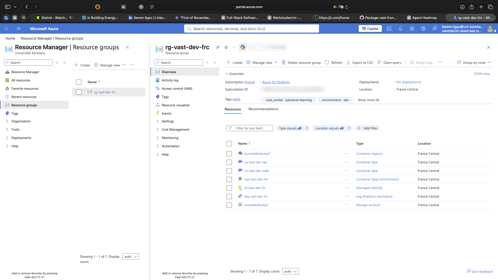

# Agent Heatmap + Network (VAST Challenge MC1)

A single-screen visual analytics dashboard for the VAST Challenge MC1 multi-agent
crisis dataset. Everything below is driven by one shared set of filters and a
single crisis-timeline slider, so every panel always shows the same slice of the
story at the same moment in time:

- a **heatmap** of agent activity over time (colored by message volume or
  sentiment),
- an **event flow** strip that lays out the crisis as causal event markers,
- a **stock price / market sentiment line chart** aligned to the same time
  buckets,
- a **communication network** built from `responding_to` reply relationships, and
- **detail panels** (message, message context, node, edge) that explain *why* any
  clicked item matters.

## Stack

- **Frontend:** React + Vite
- **Backend:** FastAPI
- **Database:** Neo4j (data imported from `data/MC1_final_00.json` on first start)
- Orchestrated with Docker Compose.
- **Cloud (optional):** Terraform on Azure Container Apps - see [`infra/`](infra/README.md).

## Cloud deployment

`docker compose up --build` remains the supported way to run this locally.
[`infra/`](infra/README.md) additionally describes the same three services as
infrastructure as code: a Terraform configuration that provisions the whole
stack on **Azure Container Apps** (container registry, managed identity, Log
Analytics, Azure Files persistence for Neo4j) with one `terraform apply`, plus
GitHub Actions workflows that build the container images and lint/validate the
Terraform on every pull request. Nothing in this directory is required to run
the project locally.



*The full stack, provisioned by a single `terraform apply` and removed again by
`terraform destroy`. More screenshots and the deployment walkthrough are in
[`infra/README.md`](infra/README.md).*

## Quick start

```bash
docker compose up --build
```

On first start the backend waits for Neo4j to become healthy, then imports the
MC1 JSON into Neo4j automatically. Subsequent starts reuse the existing data.
Open **http://localhost:5173** and you are ready to explore.

| Service        | URL                              |
| -------------- | -------------------------------- |
| Frontend       | http://localhost:5173            |
| Backend (API)  | http://localhost:8000            |
| Backend health | http://localhost:8000/api/health |
| Neo4j Browser  | http://localhost:7474            |
| Neo4j Bolt     | bolt://localhost:7687            |

Neo4j credentials (dev default): `neo4j` / `password123`.

---

# Usage guide

The screen is organized top-to-bottom: a **global control bar**, the **crisis
timeline slider**, and then the visualization area (heatmap + event flow + line
chart on the left/top, network on the right/bottom). A change to any filter or to
the timeline updates every visible panel at once.

## 1. Global control bar (top)

- **Show visualizations** — checkboxes to toggle **Heatmap**, **Event flow**,
  **Line Chart**, and **Network** on or off. Hide what you don't need to give the
  rest more room.
- **◧ Side-by-side** — places the heatmap and network next to each other for
  direct comparison. While on, it hides the filter panels, the event flow, and the
  line chart.
- **Show / Hide filters** — collapses the left filter panels so the charts get
  full width.
- **Clear all filters** — resets every filter (heatmap, network, and the crisis
  timeline) back to defaults. View modes like Daily/Hourly are kept.
- **Reload DB** — re-imports the source data into Neo4j (see *Admin* below).
- The counter on the right shows how many messages are **merger-related**
  (`combined` / `total`, split into *Content* vs *Inner thought*).

## 2. Crisis timeline slider

A dual-handle range slider spanning every round of the scenario. It is the master
time control — **all** panels obey it.

- Drag the **left handle** to set the window start, the **right handle** to set
  the window end.
- Press **Play** to animate the end handle forward one round at a time (Pause to
  stop). This "plays" the crisis so you can watch activity and sentiment evolve.
  The network keeps a small playback HUD showing the current round / date /
  headline.
- **Daily / Hourly** switches the time-bucket granularity used everywhere.
- Anchor events are marked on the track, e.g. the **leak** (~17:00) and the
  **embargo lift** (June 5, 18:00).

## 3. Heatmap and its filters

The heatmap shows each **agent** (rows) against **time buckets** (columns).

**Filters (left panel):**

- **Search keyword** — free text (e.g. `merger`, `embargo`, `lawsuit`); cells are
  colored/counted by matches.
- **Heatmap mode** — two buttons: **Count Heatmap** (message volume) and
  **Sentiment Heatmap**.
- **Message channel** — *All*, or pick from two groups: **External**
  (public-facing: personal / official / anonymous posts) and **Internal**
  (in-org conversation: comms huddle, one-on-one chat, side huddle). Filtering is
  by channel × message type.
- **Text sources** — which text to search/score: *Message content* and the three
  **inner-thought** streams (reacting, rationalizing, deliberating).
- **Agent type** — narrow to specific agents.
- **Close meaning keywords** — after you click a heatmap cell, this lists keywords
  extracted from that cell's messages, each with a relevance score. Click a
  keyword chip to search it.

**Interactions:**

- **Click a cell** → the **Message detail** panel lists the messages behind it.
- **Click an agent's name** → highlights that agent in the network (click again to
  deselect).

## 4. Event flow

A compact causal strip that lays the crisis out as event markers, so the jury
doesn't have to hunt for "where did it happen?". Marker shapes/colors:

| Marker | Meaning |
| ------ | ------- |
| ▲ teal | Decision |
| ✖ blue | External pressure |
| ✖ red  | Internal leak |
| ● gray | Agent silent |
| ● pink | Result |

Arcs between markers show causal links. **Click an event** to see a one-line
explanation plus the messages decisively related to it.

## 5. Line chart

Overlays the **stock price** and a **market sentiment** signal on the same time
buckets as the heatmap, with the same anchor-event markers. Under **Line chart
series** you can independently toggle the **Stock price** line (cyan) and the
**Market sentiment** line (amber). Corrected data points are emphasized and
tappable to show the reason for the correction.

## 6. Communication network (reply graph)

Nodes are agents; edges are reply relationships derived from `responding_to`.
Dashed edges are **name-mention** edges (name-addressing like `Judge — …`), which
are shown but not counted as replies.

**Controls (network filter panel):**

- Its own **Message channel** and **Agent type** filters — *or* tick **Mirror
  heatmap filters** to make the network reuse the heatmap's filters, sort order and
  node sizing so the two views stay perfectly in sync.
- **Layout** — **Default** (force-directed) or **Circle**.
- **Node size** — **Message count**, **Merger-related count**, or **Sentiment
  score**. (When mirroring the heatmap sorted by sentiment, nodes are also colored
  by sentiment automatically.)
- **Selected node** — after clicking a node, shows its Messages, Merger-related
  count, and Sentiment score.

Edge color encodes the channel; parallel edges fan out when agents talk over
multiple channels.

**Interactions:**

- **Click a node** → the **Node messages** panel (includes broadcast/root messages
  that have no edge).
- **Click an edge** → the **Edge messages** panel (the messages that form that
  reply relationship).

## 7. Detail panels

- **Message detail** — messages behind a clicked heatmap cell. Click any message
  to open its **Context**.
- **Message Context / Related Messages** — explains why a message matters by
  surfacing its thread and neighbors (see the API section below).
- **Node / Edge messages** — messages behind a clicked network node or edge.
- **Conversation Flow** — a modal that traces a thread end to end.

## Typical workflow

1. Press **Play** on the timeline (or drag the handles) to find when activity
   spikes.
2. Type a keyword such as `embargo` and switch the heatmap to **Sentiment
   Heatmap** to see who reacts and how.
3. **Click the hottest cell** to read the underlying messages, then click one to
   open its **Context** and follow the thread.
4. **Click that agent's name** to highlight them in the **network** and see who
   they were replying to — or tick **Mirror heatmap filters** to keep both views
   aligned.

---

## Message Context / Related Messages (API)

Click a heatmap cell to list its messages, then click any message to open its
**Context** section. The backend endpoint:

```
GET /api/messages/{message_id}/context
```

returns the selected message plus related messages grouped as:

- `parent_message` – the message referenced by `responding_to`
- `replies` – messages whose `responding_to` is the selected message
- `temporal_neighbors` – previous/next messages in the same round
- `same_channel_context` – nearby messages in the same channel (time-windowed)
- `same_agent_context` – the same agent's previous/next messages
- `keyword_related` – same-round messages sharing a crisis keyword
- `all_related` – flattened, de-duplicated union of the above

Each related item carries `relation_type` and a human-readable `relation_reason`,
and the selected message carries a heuristic `why_matters` explanation. This
feature uses only graph structure, timestamps, channels, and a fixed crisis
keyword list — **no ML model is required**.

## Fast mode vs. ML features

The default backend image is intentionally lightweight (no `torch` /
`transformers` / `sentence-transformers`). Semantic-embedding and BERT-sentiment
features **gracefully degrade** to frequency-based keywords and a lexicon
sentiment fallback. To enable the full ML models, install the optional extras
inside the backend image:

```bash
pip install -r requirements.txt -r requirements-ml.txt
```

## Admin

- **Reload DB** button (or `POST /admin/reload`) re-imports the source JSON. Use
  it after changing `data/MC1_final_00.json`.

## Known limitations

- In fast mode, the **Sentiment Heatmap** and the **Close meaning keywords** use
  lightweight fallbacks (lexicon sentiment + frequency-based keywords) instead of
  the ML models — lower quality, but identical API shapes.
- The backend `/api/heatmap` endpoint still accepts a `semantic_change` mode, but
  the current UI only exposes **Count** and **Sentiment**; semantic change is not
  surfaced in the dashboard.
- Neo4j data import runs once on first start; use `POST /admin/reload` to
  re-import after changing the source JSON.
- `same_channel_context` is capped to the nearest 8 messages and
  `keyword_related` to 10 to keep the panel readable.
- Dev-only Neo4j credentials are hard-coded in `docker-compose.yml`; change them
  before any non-local use.

## Credits

Agent identity icons use [Twemoji](https://github.com/jdecked/twemoji) graphics,
Copyright Twitter, Inc and other contributors, licensed under
[CC-BY 4.0](https://creativecommons.org/licenses/by/4.0/).
The SVGs are inlined as data URIs in `frontend/src/agentIcons.jsx` (no runtime
network fetch, no OS emoji-font dependency).
