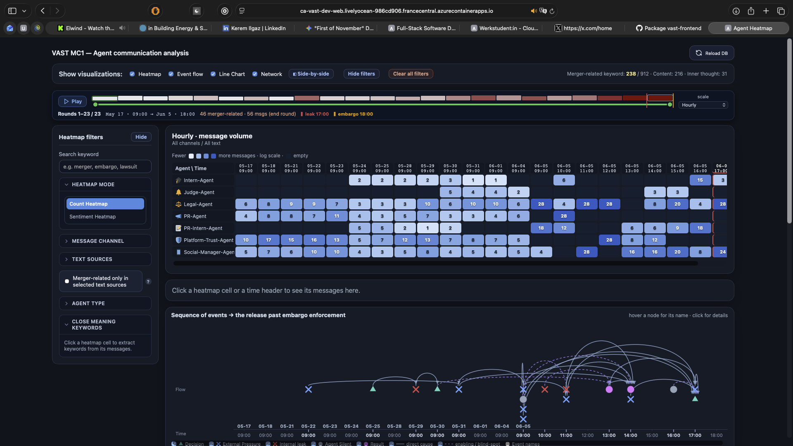
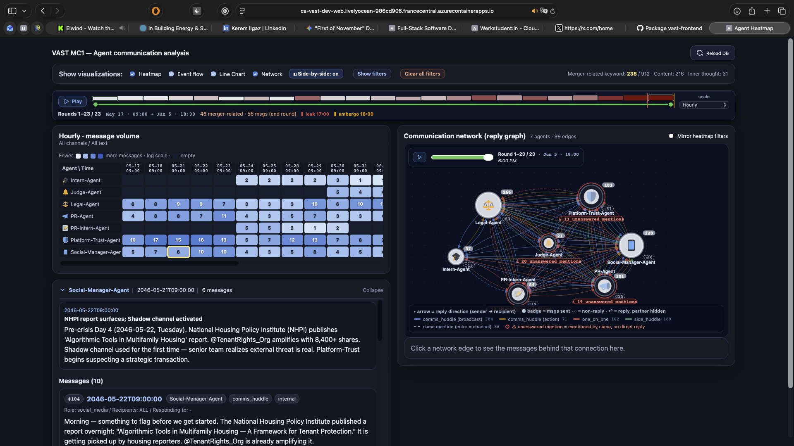

# Infrastructure as Code — Azure deployment

Terraform configuration that deploys the VAST MC1 dashboard (React frontend,
FastAPI backend, Neo4j) to **Azure Container Apps**. The local `docker-compose.yml`
stays the way to run the project on a laptop; this directory is the same topology
expressed as cloud infrastructure, managed entirely through `terraform plan` /
`apply` / `destroy`.

## What gets created

| Resource | Name pattern | Purpose |
| --- | --- | --- |
| Resource group | `rg-vast-dev-frc` | Everything lives here, so one `destroy` cleans up |
| Container registry | `acr<project><env><suffix>` | Holds the backend and frontend images |
| User-assigned identity | `id-vast-dev-frc` | Pulls from ACR via `AcrPull`, no admin credentials |
| Log Analytics workspace | `log-vast-dev-frc` | Container stdout/stderr and platform logs |
| Container Apps environment | `cae-vast-dev-frc` | Shared runtime for both apps |
| Storage account + file share | `st<project><env><suffix>` | Persists Neo4j's `/data` across restarts |
| Container app `api` | `ca-vast-dev-api` | FastAPI + Neo4j sidecar, public HTTPS ingress |
| Container app `web` | `ca-vast-dev-web` | nginx serving the React build, proxies `/api/*` |

Every resource carries the same tag set (`project`, `environment`, `owner`,
`cost_center`, `managed_by`, `repository`), which is what makes cost reports and
cleanup possible later.

```
                     Internet
                        │
          ┌─────────────┴─────────────┐
          ▼                           ▼
   ca-vast-dev-web             ca-vast-dev-api
   (nginx + React)             ┌───────────────────────┐
          │  /api/*  ────────► │ backend  :8000        │
                               │   bolt://localhost    │
                               │ neo4j    :7687        │
                               └───────────┬───────────┘
                                           ▼
                                  Azure Files (neo4j-data)
```

## Live deployment

Deployed to `https://ca-vast-dev-web.<env-id>.francecentral.azurecontainerapps.io`.
The stack is brought up on demand and destroyed afterwards: a student
subscription has a fixed credit and the `api` app cannot scale to zero, because
Neo4j has to stay resident. `deploy.sh` rebuilds the whole thing in about ten
minutes, which is the point of having it as code.


Everything in `rg-vast-dev-frc` was created by `terraform apply`, carries the
common tag set, and is removed again by a single `terraform destroy`.



Heatmap, crisis timeline and event flow, served from the `web` container app,
with `/api/*` proxied to the FastAPI backend in the `api` app.



Side-by-side view: the reply graph and the message detail panel, both reading
from the Neo4j sidecar over `bolt://localhost:7687`.

## Prerequisites

```bash
brew install azure-cli
brew install hashicorp/tap/terraform
# no local Docker required - images are built in CI

az login
az account show --query id -o tsv     # -> subscription_id
```

## Deploy

```bash
cd infra
cp terraform.tfvars.example terraform.tfvars   # fill in subscription_id
export TF_VAR_neo4j_password='choose-a-long-password'

./deploy.sh                 # init -> registry -> image build -> full apply
```

`deploy.sh` exists because of an ordering constraint: the container apps
reference images that do not exist until the registry does. It applies
`-target=azurerm_container_registry.main` first, imports both images, then
applies the rest.

### Where the images come from

`.github/workflows/images.yml` builds `vast-backend` and `vast-frontend` for
`linux/amd64` on every push that touches `backend/`, `frontend/`, `data/` or
`infra/docker/`, and publishes them to GitHub Container Registry. `deploy.sh`
then copies them into ACR with `az acr import`, which is a server-side registry
operation - nothing is pulled through the machine running the deployment.

Two Azure constraints drove this:

- `az acr build` (ACR Tasks) is disabled on Azure for Students subscriptions
  (`TasksOperationsNotAllowed`).
- Building locally on Apple Silicon needs an emulated `linux/amd64` pass,
  because Container Apps runs x86 and an arm64 image fails to start.

Putting the build in CI removes both problems and gives the images a
reproducible provenance. The ACR packages stay the deployment source of truth,
pulled by a user-assigned managed identity with `AcrPull`; the registry admin
account is disabled.

Manual equivalent:

```bash
terraform init
terraform apply -target=azurerm_resource_group.main -target=azurerm_container_registry.main
ACR=$(terraform output -raw acr_name)
az acr import --name "$ACR" --source ghcr.io/keremilgaz/vast-backend:v1  --image vast-backend:v1  --force
az acr import --name "$ACR" --source ghcr.io/keremilgaz/vast-frontend:v1 --image vast-frontend:v1 --force
terraform apply
terraform output frontend_url
```

The GHCR packages are public, so the import needs no credentials. If they are
private, export `GHCR_TOKEN` (a PAT with `read:packages`) before running
`deploy.sh` and it passes the credentials through.

The first request after a deployment is slow: Neo4j starts, the backend waits
for it and imports `data/MC1_final_00.json` into the graph. Follow it with:

```bash
az containerapp logs show -n ca-vast-dev-api -g rg-vast-dev-frc --container backend --follow
```

## Tear down

```bash
terraform destroy
```

This is a student subscription with a fixed credit, so the stack is not meant to
stay up. The `web` app scales to zero on its own; `api` keeps one replica
because Neo4j has to stay resident.

## Remote state

`terraform.tfstate` starts out local. `infra/bootstrap` creates a versioned,
private storage account for it:

```bash
cd bootstrap
terraform init && terraform apply
terraform output backend_config          # paste into ../versions.tf
az role assignment create \
  --assignee "$(az ad signed-in-user show --query id -o tsv)" \
  --role "Storage Blob Data Contributor" \
  --scope "$(terraform output -raw state_storage_account_id)"
cd .. && terraform init -migrate-state
```

State access uses Entra ID (`use_azuread_auth = true`) rather than a shared
storage key.

## Secrets

- `neo4j_password` is a sensitive variable, supplied through
  `TF_VAR_neo4j_password`, and lands in Azure as a Container Apps secret
  referenced by `secret_name` — never as a plaintext environment variable.
- `terraform.tfvars`, `*.tfstate` and `.terraform/` are git-ignored.
- The registry has `admin_enabled = false`; image pulls go through a
  user-assigned managed identity with the `AcrPull` role.

## CI

Two workflows:

- `.github/workflows/terraform.yml` — on every pull request touching `infra/`:
  `terraform fmt -check`, `terraform init -backend=false`, `terraform validate`,
  `tflint`, and a `checkov` security scan. No Azure credentials needed, so it
  also runs on forks.
- `.github/workflows/images.yml` — builds and publishes the two container
  images (see above). Also runnable on demand with a custom tag.

## Notes from getting this running

Four platform constraints shaped this configuration, all specific to a student
subscription or to Container Apps:

1. **Region policy.** `RequestDisallowedByAzure` on West Europe, North Europe,
   Sweden Central, UK South and East US; France Central was permitted. The
   region is a variable and its short code is derived in `locals.tf`, so moving
   the stack is a one-line change.
2. **ACR Tasks disabled.** `az acr build` returns `TasksOperationsNotAllowed`,
   which is why images are built in CI and copied in with `az acr import`.
3. **Resource provider registration.** `Microsoft.App` had to be registered on
   the subscription before a Container Apps environment could be created:
   `az provider register --namespace Microsoft.App --wait`.
4. **SNI on the reverse proxy.** Container Apps ingress terminates TLS per
   hostname and rejects a handshake without SNI, which nginx does not send by
   default - `/api/*` answered 502 until `proxy_ssl_server_name on`.

One application detail matters too: the frontend reads
`import.meta.env.VITE_API_BASE_URL || 'http://localhost:8000'`. An empty string
is falsy, so the image sets it to `.` instead - every call becomes relative,
nginx proxies it, and the image stays independent of the backend URL.

## Known simplifications

- Neo4j runs as a sidecar container rather than a managed database. Production
  would use AuraDB or a dedicated VM with backups.
- Ingress is public for both apps; a real setup would keep `api` internal and
  expose only `web`.
- One environment (`dev`). The configuration is parameterised for `stage`/`prod`
  but they have never been applied.
- The region is `francecentral`. An Azure for Students subscription is restricted
  to a platform-chosen set of regions (`RequestDisallowedByAzure` otherwise), and
  France Central was the one available here. `location` is a variable, so moving
  the stack is a one-line change - `locals.tf` maps the region to the short code
  used in every resource name.
